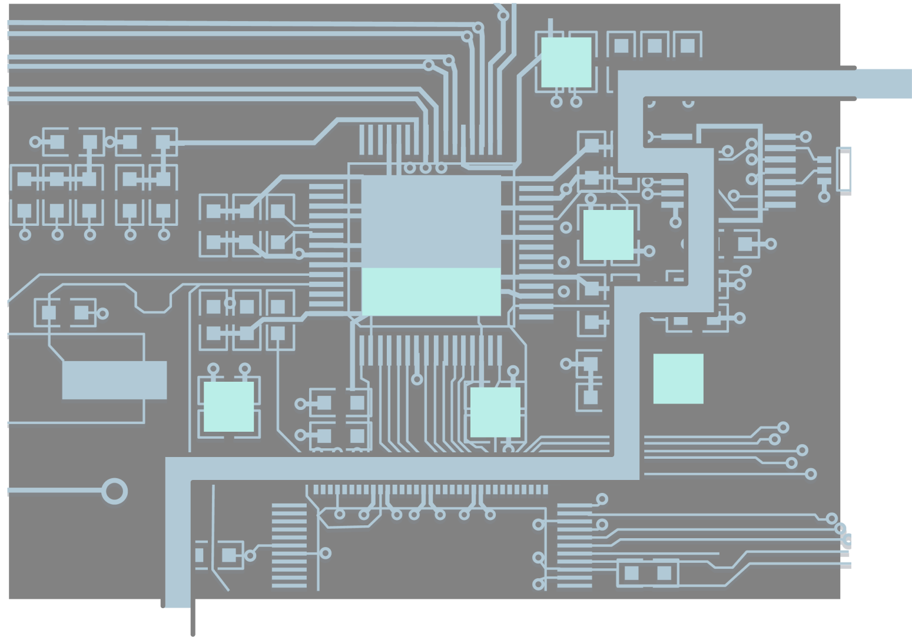
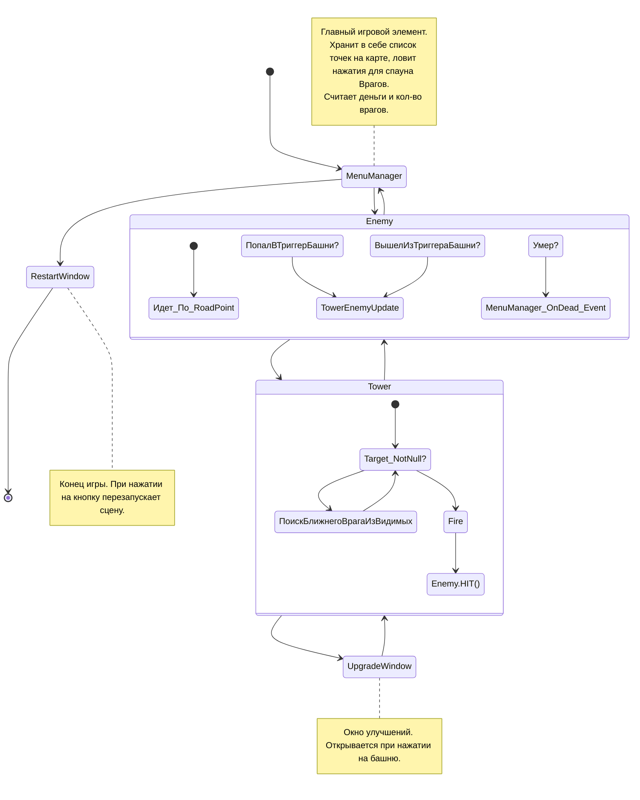

# TowerDefence2022.03Unity3D

TestProjectFor2RealLife 

### Оглавление
1. [Приоритет](#приоритет)
2. [Правила](#правила)
3. [Архитектура](#Архитектура)
____
## Приоритет  
- В данной игре приоритет был сделан на скорость создания игры с 0 до рабочего MVP. 
- Нет использованных ассетов.
- Использовал различные варианты взаимодействия между скриптами, разные способы для одинаковых действий, чтобы показать как можно больше собственных знаний.
- Разработка игры заняла 3 вечера (~ 8 часов).
- Не стал оптимизировать до совершенства - можно убрать все GetComponent<>, закрыть все поля и сделать доступ по свойствам, использовать только евенты и делегаты, а так же сделать базовые классы для Tower, Enemy и наследовать их для разных типов башен
- , но добавил возможность для развития игры. (Легко можно интегрировать, легко переделывается).
- Игра откомпилирована на Android.
____
## Правила  
### Описание: 
Вид на Процессор в компьютере. Нам нужно вывести его из спящего режима путем кликов/тапов. (Каждое нажатие производит один ТИК компьютера)
### Враги: 
При клике, появляются мобы (ошибки/тики, называйте как хотите). Максимально доступное кол-во врагов для вызова на КАЖДОМ уровне отображается на панеле сверху слева.
- При клике есть вероятность, что появятся либо Тики(зеленые), либо Баги (красные). 
- Количество багов можно увидеть на панели сверху слева.
- Баги появляются с разным здоровьем и скоростью.

### Башни
- Есть 3 уровня. 
- Улучшайте башни чтобы повысить урон, скорость атаки и радиус обстрела.
- Башни будут атаковать Ошибки, пока они не превратятся в Тики. 
- 1 выстрел из башен стоит 1 энергию. 
- За убийство Ошибок дается энергия. Когда Тики доходят до конца карты, так же дается энергия.

### Цель - пройти 2 уровня или набрать 1000 энергии.
- Уровень считается пройденным, если не осталось Багов и все клики на уровне использованы.
- Уровень считается проигранным, если хотя бы одна Ошибка доходит до конца карты.
____
## Архитектура  

____
## Тех Документация
Подробные объяснения на Тех интервью.

____
